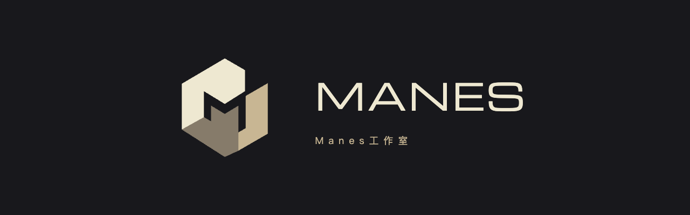

# MANES 品牌资源

2026-09-17 选定 **③「构域 / SPATIAL CORE」**。品牌名称为 Manes工作室，界面字标为 **MANES**。开放等轴结构围合出中央 M 负形，三块平面使用暖白 `#EEE8D1`、香槟 `#C8B693`、灰褐 `#867B6A`；深色底座为 `#18181C`。

概念由 OpenAI 内置 imagegen 生成，落地稿按选中轮廓精修为原生 SVG 路径，清除生成图边缘杂点与面内渐变。SVG 不含内嵌位图、外部字体或脚本。

| 资源 | 用途 |
| --- | --- |
| [manes-mark.svg](../../public/brand/manes-mark.svg) | 透明彩色矢量母版，保持原比例使用 |
| [manes-icon.svg](../../public/brand/manes-icon.svg) | 深色圆角底座版，页面标志及浏览器 favicon |
| [manes-mark-mono.svg](../../public/brand/manes-mark-mono.svg) | 暖白单色矢量版，适合深色背景 |
| [manes-mark.png](../../public/brand/manes-mark.png) | 256 × 256 兼容 PNG，旧资源路径也已更新为构域 |
| [manes-favicon-32.png](../../public/brand/manes-favicon-32.png) | 32 × 32 浏览器图标回退 |
| [manes-touch-180.png](../../public/brand/manes-touch-180.png) | 180 × 180 Apple 收藏 / 主屏图标 |
| [manes-logo-original.png](manes-logo-original.png) | 选中方案③的原始生成图，作为设计溯源 |
| [完整实际生成提示词](manes-spatial-prompt.txt) | 原始生成与定向清理提示词，均为内置 imagegen |

图标最小预览检查覆盖 16 / 24 / 32 / 40 / 64 px；正式界面优先 SVG。浅色界面使用深色底座版以保留三平面对比。字标沿用项目 Michroma，正文沿用 Manrope / 中文系统字体。

本轮覆盖大屏展示、编辑画布、浏览器 favicon、Apple 图标、兼容 PNG、项目说明和品牌文档。旧默认品牌迁移、自定义名称与已有画布数据保持不变。按用户指定范围，影片工程不在本轮修改中。

验收记录见 [verification.md](verification.md)。旧日期的历史界面证据保留原始画面，当前效果以 2026-09-17 的构域验收图片为准。
