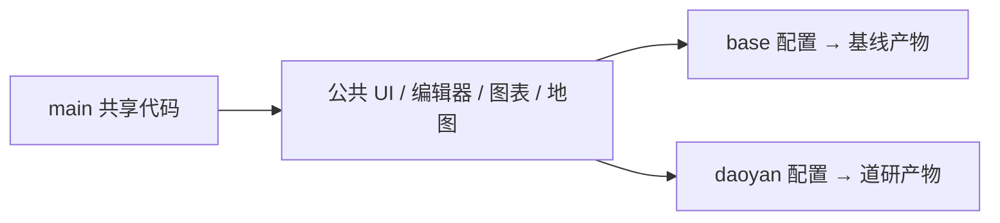

# 基线与道研的共同开发

两版在同一 `main` 主线维护，启动和构建时选择项目配置。默认使用基线；道研业务差异集中在配置、默认数据和车辆功能文件中。



## 配置与开发入口

| 内容 | 基线 `base` | 道研 `daoyan` |
| --- | --- | --- |
| 项目配置 | `src/projects/base.js` | `src/projects/daoyan.js` |
| 默认画布 | 通用五卡 | 保存的左侧三卡与车辆地图 |
| 品牌 | MANES 标志、名称及 favicon | 隐藏品牌，直接显示业务标题 |
| 车辆 | 不加载默认业务快照 | `src/projects/daoyan-vehicles.json` |
| 本地启动 | `npm run dev:base`，5173 端口 | `npm run dev:daoyan`，5175 端口 |
| 单独构建 | `npm run build:base` | `npm run build:daoyan` |
| 独立产物 | `releases/base/` | `releases/daoyan/` |

`npm run dev`、`npm run build` 默认选择基线。两个开发服务器可同时运行，各自使用独立 Vite 缓存。Vite 的 `--mode base` / `--mode daoyan` 在启动或构建时选择 `@project`，未知模式报错。普通使用者不在页面中切换项目。

`id` 决定存储归属，`showBrand` 决定品牌显示，`vehicles` 决定车辆入口，`preset` 提供项目默认画布。调整配置后重启开发服务或重新构建。主题、字体、画布和数据源继续通过原编辑器修改。

| 后续需求 | 修改位置 |
| --- | --- |
| 两版都受益的 UI、配色、字体、编辑操作 | 原公共组件和样式，验证两版 |
| 道研默认标题、卡片布局、数据绑定 | `src/projects/daoyan.js` |
| 道研初始车辆快照 | `src/projects/daoyan-vehicles.json` |
| 当前浏览器接入自己的数据 | 编辑器的数据源及字段绑定 |
| 车辆定位、详情、悬浮和图表联动 | `vehicles.js`、`useVehicleLayer.js`、`VehiclePanels.jsx` |

公共文件不直接导入道研快照。地图接收 `vehicles` 参数，未提供时为空；车辆数据更新仅重新投影车点，不重建行政区几何。当前不引入插件框架、远程配置服务或两套页面副本。

## 单一车辆数据源

道研默认地图和三卡绑定 `ds_daoyan_vehicles`。通过数据源面板改一份记录，车辆总数、行驶/静止占比、各车速度和地图一起更新。地图绑定可在选中地图后的 **车辆数据源** 中修改或解除；源仍有使用方时不能删除。

必要字段为 `VEHICLENO`、`GEO_LON`、`GEO_LAT`、`GPS_SPEED`。号牌非空且唯一，不能使用 `all/moving/stopped` 联动保留名称；坐标和速度接受有效数字或数字字符串，空值不补零，速度不能为负。其余展示字段接受文字、数字或空值，保留原始编码。当前仍未做坐标系转换。

车辆适配自动补充 `name`、`count`、`code`、`status`、`stateCode`。状态按 GPS 速度划分，状态卡使用通用 `binding.groupBy: "name"` 合并求和。同组编码冲突会报错，避免点错车辆。增删车辆同步生效；空列表显示空态，接口更新失败可保留上次数据并标记延迟，不回退五车快照。

`docs/daoyan-vehicles.canvas.json` 是整合前画布归档和迁移测试样本，不是运行时的第二份数据源。存量画布的标题、布局、单位和显示精度会保留；例如速度卡原来是零位小数，详情仍显示原始速度。

## 存储与迁移

| 内容 | 存储键 |
| --- | --- |
| 基线画布 | `manes.dashboard.base.config.v2` |
| 道研画布 | `manes.dashboard.daoyan.config.v2` |
| 基线模板 | `manes.dashboard.base.templates.v1` |
| 道研模板 | `manes.dashboard.daoyan.templates.v1` |

配置仍使用 `version: 2`，增加 `projectId`。显式保存和模板操作只写当前项目的键；导出携带项目标识，跨项目导入拒绝覆盖。项目配置是前端功能选择，不能代替服务端权限。

首次读取优先本项目新键；没有新键时检查旧 `nexus.dashboard.config.v2/v1` 和 `nexus.dashboard.templates.v1`。已知旧道研源标识归道研，旧通用演示布局归基线；其他旧记录不猜归属，可在模板库的 **旧版配置恢复** 中显式载入。旧道研画布的地图与状态卡会接到同一车辆源，保留卡片布局，用户之后解除绑定会正常保留。

读取不写回。载入到草稿后可撤销，点击 **保存画布** 才写新键；旧字节一直保留。损坏的新画布返回项目默认显示但不删除存储，损坏模板库报错并拒绝覆盖。**恢复项目默认画布** 也只修改草稿，保存后生效。

浏览器存储按域名、协议和端口区分。原地址升级可直接读取旧记录；更换地址或端口时，先从旧页面导出 JSON，再在对应项目中导入。代码中的默认预设不会覆盖已保存的用户画布。

## 测试与交付

```sh
npm ci
npm run verify
```

`verify` 依次检查全量地图数据、功能和地图回归、两版构建、Sites worker 和产物边界。全新检出时先构建，再检查生成的 Sites 文件。基线包中不得出现道研源标识、GPS 快照和车辆状态样本。GitHub Actions 对 `main` 推送和 PR 运行相同检查。

`npm run build:all` 顺序构建两版，保留 `releases/base` 和 `releases/daoyan`；每版都有 `client`、`server`、`.openai` 和 `project.json`。静态服务使用各自 `client`，Sites 使用对应整套目录。`dist` 与 `npm run preview` 指向最后一次构建，发布前核对项目，原 Sites 文件约定不变。

界面变更还应运行 `npm run test:browser`。该检查使用独立 Playwright 浏览器，不改日常浏览器配置。可用 `BASE_URL`、`DAOYAN_URL` 指定本地预览地址，`REFERENCE_URL` 提供整合前参考；运行环境需有 Playwright，可用 `PLAYWRIGHT_MODULE` 和 `CHROME_EXECUTABLE` 指定已有安装。脚本检查两版品牌、保存重载、字体资源、底图、区县、车辆联动、迁移和紧凑窗口，截图及结果写入 `docs/evidence/projects/`。

本轮验证：121 项功能测试、16 组地图回归、4 项 Sites 测试、3238 个地理索引条目及两版构建通过。浏览器验收结果见 [记录](evidence/projects/browser-checks.json)，视觉对照见 [整合前](evidence/projects/before-overview.png)、[道研迁移后](evidence/projects/daoyan-migrated.png)、[基线版](evidence/projects/base-overview.png)、[道研版](evidence/projects/daoyan-overview.png)。这些是本机构建与浏览器验证。

## 分支与回退

新需求从最新 `main` 开短期功能分支，改公共 UI 时同时检查两版，改道研数据时仍构建基线确认边界，完成后合入 `main`。原 `daoyan` 分支停在整合前快照 `527a9f6`，只用于历史追溯和回退，不再承担日常产品开发。

回退时新建独立目录检出原快照，或部署保留的上一版产物；旧页面继续读取旧存储键。整合后新保存的画布仍留在新键中，恢复新版后可以继续使用。不要用强制推送或清空浏览器存储进行回退。
